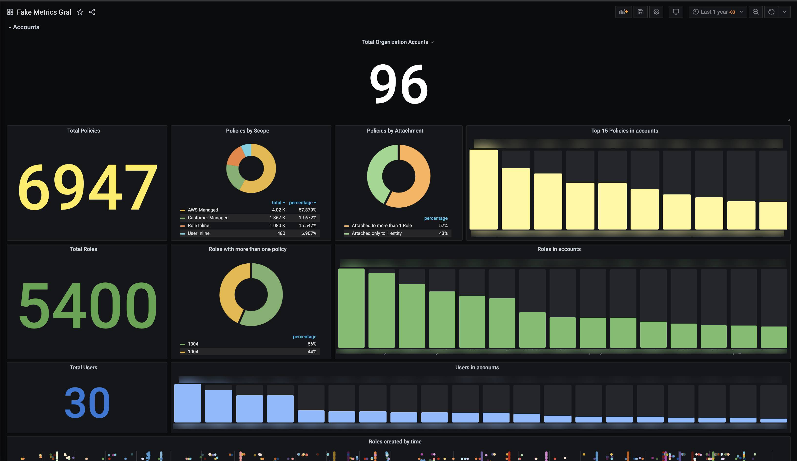
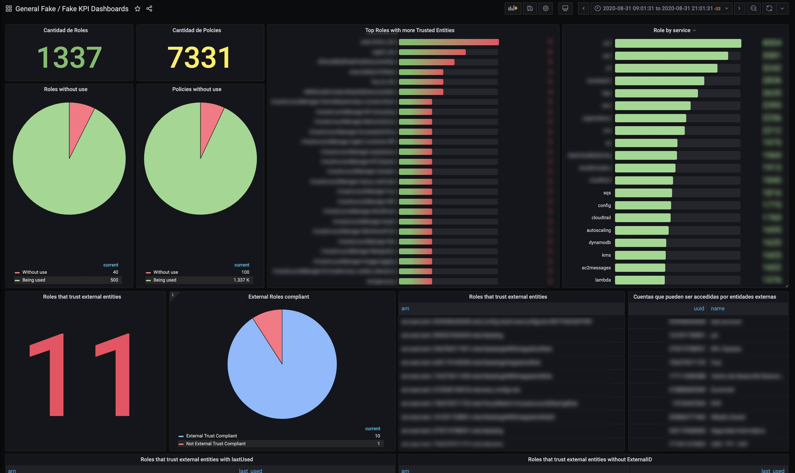
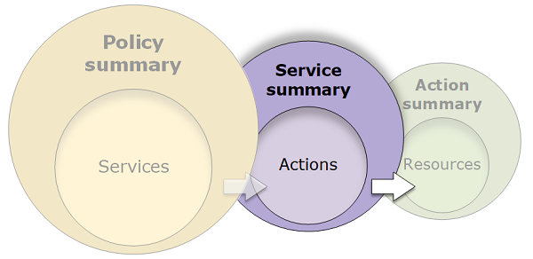

# PoLP Fiction 

 

[](https://discord.gg/y3hBp7bwsy)  [](https://mercadolibre.com)

## Abstract
Polp Fiction is an in-house tool developed at [Mercadolibre](https://www.mercadolibre.com.ar/) that aims expose metrics of the current situation regarding privileges based on identities and access on AWS in order to implement the [PoLP](https://en.wikipedia.org/wiki/Principle_of_least_privilege) principle.
## 🎯 Goal
Its main objective is to show a clear vision on how the business is in terms of Users, Roles and API privileges in the cloud, centralize all this data in a single query point where specific information can be obtained to make strategic decisions that can improve the access management security between all our different identities across and within accounts.

## 🛠  Installation
Ensure that you have Python 3.6 or later.

```
git clone git@github.com:mercadolibre/polp-fiction-metrics.git polp-fiction
cd polp-fiction
python3 -m venv venv
source venv/bin/activate
python setup.py develop
```

## ⚙️ Configuration

Polp Fiction has a single configuration file (`app/config.json`) where you can specified all your configuration parameters for different scope / environments. 
Here's the sample configuration for the `local` environment
```json
{
"local": {
   "mysql":{
        "host":"localhost",
        "user":"polpuser",
        "passwd":"polpsecret",
        "db":"polpdb",
        "port":"3308"
    },
    "blacklist" : "1234512345,54321543212",
    "iam":{
        "polp-role": "polp_fiction_role",
        "polp-organization-role" : "",
        "polp-master-account" : "1234567890"
    }
    },
    ". . ."
```

### 🔭 Scopes
Polp has two ways of running: **Single Account** which will analyze only the master account and **Multi Account** which will aim to scan all the accounts under an AWS Organization (master account). The scope can be easily changed by setting an environment variable *SCOPE*.
* **local**: Runs the app locally for several accounts.
* **jobs**: Production ready scope.
* **test**: Testing environment scope.
* **single-account**: Lets you run the application just for the master account and doesn't need the creation of IAM Roles

### 🔑 IAM Permissions:

If we wish to scan all the account under the organization we would like to create a role in the master account called `POLPOrganizationRole` and you will also need to create the role mentioned above on every single account within the organization.

#### Policies

- `POLPOrganizationRole` should only have the `AWSOrganizationsReadOnlyAccess` AWS managed policy
- `POLPFictionRole` should only have the `IAMReadOnlyAccess` AWS managed policy. Both roles should have the role the app is running with within their trusted entities in order to be assumed and it goes without saying that the role you decide to run the application with must have the ability to call `sts:AssumeRole` into these Roles

## ⌨️ Development

Is important to acknowledge that in order to run a development environment with the polp cli you must have docker installed on your dev environment.

Polp Fiction has it's own *cli* to make testing and development more easy. Once inside the environment try `polp --help` to see all available commands.

```shell
(venv) $> polp database up #Might take a few secs to run the db
(venv) $> polp migrations run
(venv) $> polp run
```
*For further development there's an [ERD](docs/assets/ERD.png) that aims to describe the SQL datbase structure use in Polp Fiction*

## 🥢 Endpoints
For the moment Polp Fiction only have 2 endpoint meant for jobs `[POST]  -  /v1/job/account`  which will populate the accounts and `[POST] /v1/job/populate` which will populate the rest of data based on the accounts. 

```shell
$> curl -X POST http://localhost:5000/v1/job/account
$> curl -X POST http://localhost:5000/v1/job/populate
```
Note: If you are running polp on **single-account** mode please bear in mind that the `v1/job/account` endpoint will not be availble, instead the only account to be scanned is the master account.
## 📊 Metrics

Polp Fiction uses [Grafana](https://grafana.com/) in order to display the information gathered. We have made several dashboards that makes focus on different aspect we wanted to highlight.
To get you Grafana up and running with all of these dashboards just run the following command.
```shell
(venv) $> polp grafana
```
*Bear in mind that the database should be running by the time you decide to run Grafana. If there's any problem connecting Grafana to the db, run `polp clean` to clear Docker containers and networks*

### Metrics included

* **Account level**
  * **Services**
    * Services in used by policies
    * Top servicies with more policies
  * **Policies**
    * Attached Managed Policies count
    * AWS Managed vs Customer Managed policies
    * Top policies with more services
    * Top policies with more attachments
    * Actions summary by service in policies
  * **Roles**
    * Roles count
    * Top roles with more policies attached
    * Top roles with more trusted entities
    * Top services with more roles
  * **Users**
    * Users count
    * Policies attached to users count
    * Top policies attached to users
    * Top users with more policies
* **Organization level**
  * Total Policies, Roles and Users in the organization
  * AWS Manages vs Customer Managed policies in the organization vs Inline Policies
  * Policies with >1 attachments vs policies with just 1 entity attached
  * Roles with >1 policies attached vs 1:1 Roles
  * Top accounts with more (Roles, Policies and Users)
  * Roles creation in time with account
  * Foreign entities (Accounts, Roles and Users) with access to the organization (capable of assuming roles).
  
Organization             | By Account
:-------------------------:|:-------------------------:
|

 ## Depth and Limitations

 Polp Fiction reaches an *Service Summary* depth in permissions regarding [the AWS documentation](https://docs.aws.amazon.com/IAM/latest/UserGuide/access_policies_understand-service-summary.html). Includes *Last accessed* information for policies.  Additionally it also gather informations regarding the last time a Role was used (i.e *Last Used*) and *Trust Relationships*.



It does not support *Resource policies* nor it does *Inline Policies*.

## Resources used in this project
  *  [AWS Documentation](https://docs.aws.amazon.com/IAM/latest/UserGuide/access_policies_understand.html)
  * [Principle of Least priviledge](https://en.wikipedia.org/wiki/Principle_of_least_privilege) 
  * [Aardvark Project](https://github.com/Netflix-Skunkworks/aardvark) 
  * [Policy Universe](https://github.com/Netflix-Skunkworks/policyuniverse) 
  * [Cloudaux](https://github.com/Netflix-Skunkworks/cloudaux) 
